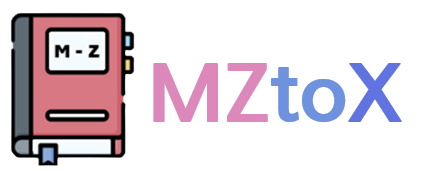

#  Project MZtoX 

    

## 1. 팀원 소개 (한국 폴리텍 대학교 서울 정수 캠퍼스 인공지능 소프트웨어과)

| 이름     | 역할                  | 기술 스택                                                                                                                                       | 소개                                           | 
|:---------|:---------------------|:-----------------------------------------------------------------------------------------------------------------------------------------------|:----------------------------------------------|
| 강병준   | 지도교수             |                                                                                                                                                 | 든든한 지도교수님                           |
| 유승호   | 팀 리더              |           | 프로젝트 관리를 담당   인공지능 서버 구축   네이버 클라우드 기반 서버 구축 |
| 변서진   | 프론트엔드 개발자    |        | 웹 애플리케이션 개발   웹 서버 구축      |
| 오상현   | 학습 데이터 구축 담당 |        | 인공지능 학습 데이터 라벨링 자료 수집 및 가공   학습 데이터 라벨링   |
| 이석호   | 백엔드 개발자        |           | Spring security를 이용한 로그인 구현   RestAPI 서버 구현              |

## 2. 개요
- **프로젝트 이름**: MZtoX
- **프로젝트 지속 기간**: 2024.07.01 ~ 2024.08.22
- **서버 제공**: 
- **OS**: 
- **개발 언어**:   
- **개발 프레임워크**:    
- **서버**:   

## 3. 구현 일정

| 구분   | 추진 내용                      | 추진  일정                      | 1주 | 2주 | 3주 | 4주 | 5주 | 6주 | 7주 | 8주 |
|--------|-------------------------------|----------------------------------|-----|-----|-----|-----|-----|-----|-----|-----|
| 도입   | 프로젝트 검토 및 예산안 설정 |                                  | ■   |     |     |     |     |     |     |     |
| 계획   | 역할 분담 및 단계 설정       |                                  | ■   | ■   |     |     |     |     |     |     |
| 실행   | AI 알고리즘 프로그래밍   (Python) |                              |     |     | ■   | ■   |     |     |     |     |
| 실행   | 백엔드 프로그래밍   (Spring Boot) |                              |     |     | ■   | ■   |     |     |     |     |
| 실행   | 프론트엔드 프로그래밍   (Vue.js) |                              |     |     | ■   | ■   |     |     |     |     |
| 테스트 | 웹 호스팅 및 디버깅         |                                  |     |     |     |     | ■   | ■   | ■   | ■   |
|        | 오프라인 미팅 계획           |                                  | ■   | ■   | ■   | ■   | ■   | ■   | ■   | ■   |

## 4. 구현 핵심 기술
### AI 서버
- kobart를 이용한 translate 모델 제작
- TCP/IP 통신을 이용한 Model 포팅
- Flask를 이용한 Router 서버 제작

## 5. 데모 사이트
우리가 만든 애플리케이션을 직접 체험해 보세요!

[**데모 사이트 방문하기**](http://mztox.aikopo.net/) (2024.08.22 까지 운영 예정)

## 6. 업데이트 내역
- **07-31** 
    1. 중복 회원가입 문제 해결
    2. 인공지능 서버 null 값 들어가는 문제 해결
 
- **08-01**
    1. 최근 번역목록 업데이트
    2. 회원 탈퇴 기능 추가
    3. 회원 약관 추가
    4. 번역 중 UI 개선
    5. 디자인 개선
    6. 모델 추론 GPU로 변경 (레이턴시 개선)

## 7. 후기
- 추후 작성 예정

## 8. Reference
- [KoBART](https://github.com/SKT-AI/KoBART)
- [Kobart-translation](https://github.com/seujung/KobART-translation)
- [AI-hub 연령대별 특징적 발화(은어·속어 등) 음성 데이터](https://aihub.or.kr/aihubdata/data/view.do?currMenu=115&topMenu=100&aihubDataSe=data&dataSetSn=71320)
